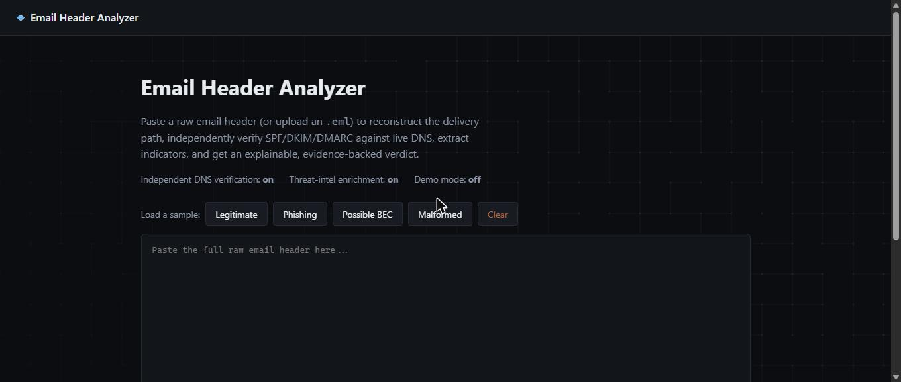
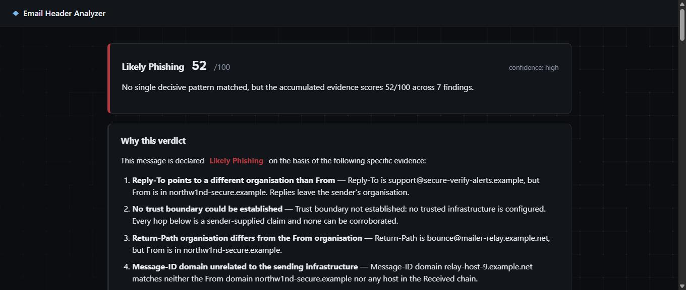

<p align="center">
  
</p>

<h1 align="center">Email Header Analyzer</h1>
<p align="center"><strong>Explainable, evidence-backed email header analysis with independent threat intelligence.</strong></p>

<p align="center">
  <a href="https://github.com/MuhammadIsmail009/email-header-analyzer/actions/workflows/ci.yml"></a>
  
  
  
  <a href="LICENSE"></a>
</p>

Built for a SOC-fundamentals internship task at Ebryx, this tool automates the manual
header-investigation workflow: SPF/DKIM/DMARC evaluation, delivery-path reconstruction,
indicator extraction, and reputation lookups, all wrapped in a small, auditable web
application.

**What sets it apart from most header analyzers:** it doesn't just parse and echo
`Authentication-Results`. It independently re-evaluates SPF, DKIM, and DMARC against
live DNS, then shows what the receiving server *claimed* next to what this tool
*verified*, flagging the two whenever they disagree. See [Independent
verification](#independent-verification) below.

<p align="center">
  
</p>

## Table of contents

- [Project purpose](#project-purpose)
- [Features](#features)
- [Architecture](#architecture)
- [Analyst workflow](#analyst-workflow)
- [Installation](#installation)
- [Environment variables](#environment-variables)
- [Demo mode](#demo-mode)
- [Running locally](#running-locally)
- [Running with Docker](#running-with-docker)
- [Tests](#tests)
- [API](#api)
- [Sample walkthroughs](#sample-walkthroughs)
- [Independent verification](#independent-verification)
- [Risk scoring](#risk-scoring)
- [Privacy and threat-intelligence limitations](#privacy-and-threat-intelligence-limitations)
- [Known limitations](#known-limitations)
- [Open-source attribution](#open-source-attribution)

## Project purpose

This project accompanies a manual SOC header investigation (documented separately) and
automates that same reasoning process. It's deliberately kept small enough to explain
end to end in a follow-up conversation. Priorities, in order: correct analyst
reasoning, reliable parsing, explainable findings, safe enrichment, a clear UI, real
tests, and accurate documentation. Not feature count.

## Features

- Raw header paste, or `.eml`/`.txt` upload (header-only parsing; body used only to
  complete DKIM body-hash verification)
- RFC-compliant header parsing: folding, duplicate fields, encoded words (RFC 2047),
  malformed input handled with warnings, never a crash
- `Received:` chain reconstruction in both stored and chronological order, with a
  drawn trust boundary, per-hop delay (computed correctly, see
  [`docs/REFERENCE_REPOSITORIES.md`](docs/REFERENCE_REPOSITORIES.md) for the bug this
  avoids), and clock-skew detection
- **Independent SPF/DKIM/DMARC verification** against live DNS, shown alongside what
  the receiving server asserted
- Sender-identity comparison (From / Sender / Return-Path / Reply-To / Message-ID)
- Domain analysis: Public Suffix List-based organisational domain, punycode/mixed-script
  detection, lookalike-domain matching against a configurable watchlist
- Microsoft `X-Forefront-Antispam-Report` / `X-Microsoft-Antispam` decoding
- IOC extraction (IPs, domains, URLs, emails) with defanging, deduplication, and
  public-only enrichment eligibility
- Threat intelligence: AbuseIPDB, EmailRep, optional VirusTotal, all async, cached,
  bounded concurrency, never fabricated, off by default
- Explainable risk engine: YAML-declared rules, per-category score caps, correlation-based
  verdict selection (not a bare threshold)
- JSON and Markdown export, both stating whether enrichment was live, fixture, or
  disabled
- Dark SOC-console UI, no external CDN, no database

## Architecture

```mermaid
flowchart TD
    Browser(["Browser"]) --> Routes

    subgraph Routes["routes/"]
        Web["web.py: HTML"]
        Api["api.py: JSON"]
    end

    Routes --> Templates["templates/ + static/<br/>Jinja2, vanilla JS/CSS, no build step"]
    Routes --> Services

    subgraph Services["services/ (orchestration)"]
        AS["analysis_service"]
        ES["enrichment_service"]
        RS["report_service"]
    end

    AS --> Core

    subgraph Core["core/ (framework-free engine, no FastAPI imports)"]
        Parsers["header_parser, received_parser,<br/>authentication_parser"]
        Domain["domain_analyzer, identity_analyzer,<br/>ioc_extractor, vendor_headers"]
        Verify["verification/<br/>live SPF, DKIM, DMARC, DNSBL"]
        Risk["risk_engine, rules_impl,<br/>rules/rules.yaml"]
    end

    ES --> Integrations

    subgraph Integrations["integrations/"]
        AbuseIPDB["AbuseIPDB"]
        EmailRep["EmailRep"]
        VirusTotal["VirusTotal (optional)"]
    end

    RS --> Export["JSON / Markdown / PDF export"]
```



| Path | Responsibility |
|---|---|
| `app/main.py` | FastAPI app factory, middleware, error handlers |
| `app/config.py` | All settings and environment variables, in one file |
| `app/security.py` | CSRF, security headers, request-size limiting |
| `app/core/` | Framework-free analysis engine (no FastAPI imports, enforced by a test) |
| `app/core/verification/` | Live SPF/DKIM/DMARC/DNSBL verification |
| `app/core/risk_engine.py`, `rules_impl.py`, `rules/rules.yaml` | Explainable risk scoring |
| `app/integrations/` | AbuseIPDB, EmailRep, VirusTotal providers |
| `app/services/` | Orchestration: `analysis_service`, `enrichment_service`, `report_service` |
| `app/routes/` | `web.py` (HTML) and `api.py` (JSON) |
| `app/templates/`, `app/static/` | Jinja2 + vanilla JS/CSS, no build step |

Full detail and the reasoning behind each boundary: [`docs/ARCHITECTURE.md`](docs/ARCHITECTURE.md).

There's no database, message queue, or cache server. Analysis is a pure function of
the submitted header plus small in-memory caches; nothing needs to survive a restart.

## Analyst workflow

The tool automates this sequence, documented in detail in
[`docs/MANUAL_EMAIL_ANALYSIS.md`](docs/MANUAL_EMAIL_ANALYSIS.md) and
[`docs/ANALYST_DECISION_RULES.md`](docs/ANALYST_DECISION_RULES.md):

1. Extract identity fields and compare them.
2. Read recorded SPF/DKIM/DMARC results, and independently re-verify them.
3. Reconstruct the delivery path bottom-up, locate the trust boundary.
4. Extract and classify indicators; enrich only public, eligible ones.
5. Correlate evidence into named findings, each with an innocent explanation.
6. Select a verdict from evidence patterns, falling back to score thresholds only when
   no pattern matches.

## Installation

Requires Python 3.12+.

```bash
git clone <this-repo>
cd email-header-analyzer
python -m venv venv
# Windows
venv\Scripts\activate
# macOS/Linux
source venv/bin/activate

pip install -r requirements.txt
cp .env.example .env
```

## Environment variables

See [`.env.example`](.env.example) for the complete, commented list. The application
runs with every value at its default, no API keys required. Key groups:

| Group | Variables |
|---|---|
| Trust boundary | `TRUSTED_RECEIVER_DOMAINS`, `TRUSTED_RECEIVER_HOSTS` |
| Independent verification | `VERIFICATION_ENABLED`, `DNS_RESOLVERS`, `DNSBL_ENABLED` |
| Enrichment | `ENRICHMENT_ENABLED` (**off by default**), `DEMO_MODE`, `*_API_KEY`, `*_ENABLED` |
| Limits | `MAX_IP_LOOKUPS`, `MAX_DOMAIN_LOOKUPS`, `MAX_URL_LOOKUPS`, `MAX_EMAIL_LOOKUPS` |
| Security | `RATE_LIMIT_ENABLED`, `CSRF_SECRET`, `LOG_RAW_HEADERS` (leave `false`) |

`ENRICHMENT_ENABLED=false` by default is deliberate, not conservative for its own sake:
phishing URLs are frequently unique per recipient, so submitting one to a third-party
scanner can tip off an attacker that their campaign was detected.

## Demo mode

Set `DEMO_MODE=true` (with `ENRICHMENT_ENABLED=false`) to see threat-intelligence
panels populated with deterministic, hand-authored fixture data for the four bundled
samples only. Every fixture result is labelled `Demo Fixture` in the UI and in
exports. A custom/pasted header's indicators are never given fixture data; they come
back `disabled`, honestly, because nothing was actually checked.

## Running locally

```bash
uvicorn app.main:app --reload
```

Visit `http://127.0.0.1:8000`.

## Running with Docker

```bash
docker compose up --build
```

or directly:

```bash
docker build -t email-header-analyzer .
docker run -p 8000:8000 --env-file .env email-header-analyzer
```

No other services are started; there's nothing else to run.

## Tests

```bash
ruff check .
pytest
pytest --cov=app --cov-report=term-missing
```

253 tests, no network access or API keys required (all DNS and HTTP is mocked:
`StaticResolver` for DNS, `respx` for `httpx`). Current coverage sits over 90%
overall and over 90% on `app/core`, comfortably above the ≥80% / ≥85% targets set in
`pyproject.toml`.

## API

Interactive docs at `/docs` (OpenAPI/Swagger) once the app is running.

| Route | Method | Purpose |
|---|---|---|
| `/` | GET | Form UI |
| `/analyze` | POST | Form submission (CSRF-protected) |
| `/samples/{name}` | GET | Serve a bundled sample (allowlisted, no path traversal) |
| `/api/v1/analyze` | POST | JSON analysis, typed request/response |
| `/api/v1/config-status` | GET | Which features/providers are enabled (never leaks key values) |
| `/health` | GET | Liveness |
| `/reports/{id}.json` | GET | Export a prior analysis as JSON |
| `/reports/{id}.md` | GET | Export a prior analysis as Markdown |

Raw header content is **never** placed in a URL or query parameter; every route that
accepts one takes it in a POST body.

## Sample walkthroughs

Four synthetic samples ship in [`samples/`](samples/), each with an expected-result
companion document:

| Sample | Verdict | Companion |
|---|---|---|
| `legitimate_header.txt` | Likely Legitimate (score 0) | [`legitimate_header_expected.md`](samples/legitimate_header_expected.md) |
| `phishing_header.txt` | Likely Phishing (score ≥50) | [`phishing_header_expected.md`](samples/phishing_header_expected.md) |
| `possible_bec_header.txt` | Possible BEC / Impersonation | [`possible_bec_header_expected.md`](samples/possible_bec_header_expected.md) |
| `malformed_header.txt` | Suspicious, no crash | [`malformed_header_expected.md`](samples/malformed_header_expected.md) |

All samples use RFC 2606 reserved domains (`*.example`) and RFC 5737 documentation IP
ranges. No real header, from any source, is in this repository; see
[`docs/REFERENCE_REPOSITORIES.md`](docs/REFERENCE_REPOSITORIES.md) for why.

<p align="center">
  
</p>

## Independent verification

Every reference project studied for this build (recorded in
[`docs/REFERENCE_REPOSITORIES.md`](docs/REFERENCE_REPOSITORIES.md)) parses
`Authentication-Results` and stops there. RFC 8601 §7.1 is explicit that this is
unsafe on its own: an attacker can place `Authentication-Results: yourcompany.com;
spf=pass; dkim=pass; dmarc=pass` into a message they send themselves.

This tool does two things differently:

1. **Trust marking.** Every asserted result is checked against configured trusted
   infrastructure (`TRUSTED_RECEIVER_DOMAINS`). With nothing configured, every
   assertion is marked `unknown` trust, never silently believed.
2. **Independent re-evaluation.** With `VERIFICATION_ENABLED=true` (default), the tool
   retrieves the sender domain's SPF record and evaluates it against the actual
   connecting IP (`pyspf`, full RFC 7208, including the ten-lookup limit), retrieves
   DKIM's public key and verifies the signature (`dkimpy`), and retrieves the DMARC
   policy and computes alignment itself rather than trusting a recorded verdict.

DKIM verification is staged honestly by available evidence: with headers only, the
signature over the signed headers is verified (proving those headers are authentic and
unmodified) but the body hash can't be checked; uploading the full `.eml` verifies
both. The UI states exactly which was done.

## Risk scoring

Findings come from declarative rules in
[`app/core/rules/rules.yaml`](app/core/rules/rules.yaml), each with a stable ID,
severity, weight, evidence requirement, and a **mandatory legitimate explanation**.
Per-category score caps prevent one noisy category (say, six minor route observations)
from outscoring one verified DMARC failure.

The **verdict is not simply the score.** Named evidence correlations are checked
first (see `app/core/risk_engine.py::select_verdict`), and only fall back to score
thresholds when nothing more specific matches. Trusted-and-verified authentication
combined with a single adverse intelligence hit is deliberately *dampened* to
Suspicious rather than escalated to Phishing: that combination is overwhelmingly the
shared-infrastructure false positive, and escalating it is how these tools generate
noise that gets them ignored.

Deliberately absent: a `Safe`/`Clean` verdict (a compromised but genuine mailbox
passes every check here), and a `BEC Confirmed` verdict (header evidence alone can't
establish business context or confirm compromise, only "Possible BEC /
Impersonation").

## Privacy and threat-intelligence limitations

- `ENRICHMENT_ENABLED=false` by default; nothing is sent to a third party unless
  explicitly turned on.
- Only public, RFC-5737/documentation-excluded IP addresses, and extracted
  domains/URLs/emails, are eligible for enrichment; never private/internal addresses.
- Provider failures never become fabricated results. Eight distinct statuses exist
  specifically so "unavailable", "disabled", "unknown" and "rate limited" are never
  rendered as "clean": see `ProviderStatus` in `app/core/models.py`.
- Full detail: [`docs/THREAT_MODEL.md`](docs/THREAT_MODEL.md) and
  [`docs/LIMITATIONS.md`](docs/LIMITATIONS.md).

## Known limitations

Stated in full, with reasoning, in [`docs/LIMITATIONS.md`](docs/LIMITATIONS.md).
Briefly: this is a **header-only** tool. No message body analysis, no attachment
inspection, no URL fetching/detonation, no machine learning, no case-management
integration, no persistence, no multi-tenancy. Each is a deliberate scope boundary,
not an oversight.

## Open-source attribution

This project's source code is entirely clean-room; no third-party code is included.
Six reference projects and two prior fellow-intern submissions were studied for
concepts (with licences individually verified against the actual `LICENSE` file, not
GitHub's sidebar badge) and are fully documented, including two licence
misrepresentation traps found along the way, in
[`docs/REFERENCE_REPOSITORIES.md`](docs/REFERENCE_REPOSITORIES.md). Runtime
dependencies are listed with their licences in [`requirements.txt`](requirements.txt);
all are permissive (MIT/BSD/Apache-2.0/ISC), no GPL or AGPL dependency is present.

## Licence

MIT, see [`LICENSE`](LICENSE).
